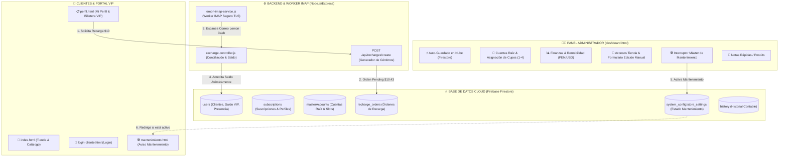

# 🐹 CuycitoGO V5.0 - Ecosistema Integral de Gestión de Streaming, Tienda VIP & Automatización

Bienvenido a **CuycitoGO V5.0**, la versión definitiva y más avanzada del ecosistema integral diseñado para la venta, control financiero, administración de cuentas raíz por cupos, catálogo web con combos de oferta, notas en tiempo real, portal de autoservicio de clientes y **sistema automatizado de recargas de saldo mediante lectura de correos Lemon Cash con IMAP**.

---

## 🚀 Novedades y Mejoras Principales en CuycitoGO V5.0

### 1. 🛠️ Interruptor Máster de Modo Mantenimiento
- **Control Centralizado en Tiempo Real**: Interruptor único ubicado en el menú superior del Dashboard que activa o desactiva instantáneamente el acceso público a la tienda web.
- **Pantalla de Mantenimiento Personalizada (`mantenimiento.html`)**: Al activarse el mantenimiento, los visitantes de la tienda web son redirigidos a una interfaz moderna y estilizada con botón directo de contacto por WhatsApp con el Administrador.
- **Indicador Visual de Estado**: Badge dinámico animado en la tienda (`🛠️ Mantenimiento`).

### 2. 🗓️ Estandarización Universal de Fechas (`Día / Mes / Año` - `DD/MM/AAAA`)
- **Flatpickr en Español Integrado**: Reemplazo completo de los campos `<input type="date">` nativos por selectores e inputs de texto enriquecidos con `Flatpickr` en español (`d/m/Y`).
- **Anulación de Configuración Regional del Sistema**: Garantiza que en cualquier navegador o sistema operativo (Windows, Android, iOS) las fechas de inicio, vencimiento y edición se muestren estrictamente en formato **`DD/MM/AAAA`** (ejemplo: `18/08/2026`).
- **Cálculo de Duración Personalizada (1 Mes = 30 Días)**: Incorporación de casilla de meses contratados tanto en *Asignación de Cupos* como en *Edición Manual*, calculando automáticamente: `Fecha Culminación = Fecha Inicio + (Meses * 30 días)`.

### 3. 🛡️ Vinculación Estricta y Unívoca por ID de Cliente (`CLI-XXXX`)
- **Seguridad Inmutable Contra Cruce de Nombres**: Filtro de seguridad que rechaza automáticamente cualquier servicio que pertenezca a otro cliente por ID de documento, `clientCode` o teléfono.
- **Aislamiento Total de Perfiles Similares**: Clientes con nombres parecidos (ejemplo: `Luis` y `Luis Oppa`) mantienen sus datos y cuentas 100% independientes sin posibilidad de duplicidad.
- **Auto-Sellado de IDs en Firestore**: Rutina de saneamiento que inyecta automáticamente `clientId`, `clientCode` y `clientPhone` en cada suscripción activa.

### 4. 👑 Regla Dinámica para la Insignia "CLIENTE VIP"
- **Requisito de 3+ Servicios Activos**: La insignia dorada **`👑 CLIENTE VIP`** se otorga de manera dinámica únicamente a los clientes que poseen 3 o más servicios activos vigentes.
- **Regresión Automática a `CLIENTE ESTÁNDAR`**: Para clientes con 0, 1 o 2 servicios activos, el distintivo se ajusta automáticamente al rango gris **`CLIENTE ESTÁNDAR`**.

### 5. 🟢 Indicador Visual de Presencia en Tiempo Real (En Línea / Desconectado)
- **Rastreador de Estado Online**: Sincronización en vivo entre `perfil.html` y el Dashboard mediante el documento `users/{userId}`.
- **Punto Verde Pulsante 🟢**: Muestra un punto verde brillante animado y la etiqueta `En línea` cuando el cliente se encuentra navegando en su portal.
- **Punto Gris ⚪**: Muestra un punto gris cuando el cliente cerró su sesión o se encuentra inactivo.

### 6. 🍋 Sistema Automatizado de Recargas con Lemon Cash (Worker IMAP Node.js)
- **Lógica de Céntimos Únicos**: Asignación automática de centavos aleatorios (ejemplo: `$10.43`) para identificar de forma unívoca la transferencia de cada usuario.
- **Worker IMAP & Regex Parser**: Monitoreo continuo de la bandeja de entrada, filtro de seguridad de remitentes oficiales Lemon Cash y acreditación atómica de saldo en Firestore.

---

## 🏛️ Organigrama & Arquitectura del Sistema



---

## 🗄️ Estructura de la Base de Datos (Firebase Firestore)

| Colección | Propósito & Estructura Principal |
| :--- | :--- |
| **`users`** | Almacena los perfiles de clientes (`id`, `name`, `nickname`, `phone`, `pass`, `balance`, `clientCode`, `isOnline`, `lastSeen`). |
| **`subscriptions`** | Contratos de servicios activos (`clientId`, `clientCode`, `service`, `email`, `pass`, `pin`, `startDate`, `endDate`, `price`, `status`). |
| **`masterAccounts`** | Cuentas matrices proveedor (`service`, `email`, `pass`, `capacity`, `profiles: [subId1, subId2, ...]`, `cost`). |
| **`recharge_orders`** | Órdenes generadas para recarga (`userId`, `exactAmount`, `currency`, `status: pending/completed`, `expiresAt`). |
| **`system_config`** | Ajustes globales del sistema (`store_settings -> { maintenanceMode: boolean, updatedAt: string }`). |
| **`store_catalog`** | Productos, combos y promociones visibles en la tienda web (`title`, `price`, `imageUrl`, `category`). |
| **`history`** | Registro contable de movimientos de ingresos y egresos. |
| **`postits`** | Notas adhesivas sincronizadas para recordatorios rápidos del administrador. |
| **`pending_registrations`**| Solicitudes de cuentas gratuitas o nuevos registros pendientes de aprobación. |

---

## 📂 Estructura de Archivos del Repositorio

```
CuzcitoGo/
├── index.html                  # Tienda Web Pública & Catálogo de Servicios
├── dashboard.html              # Panel Principal de Administración
├── perfil.html                 # Portal del Cliente VIP
├── login-cliente.html          # Inicio de Sesión de Clientes
├── mantenimiento.html          # Pantalla de Mantenimiento Tienda
├── css/
│   └── styles.css              # Estilos Personalizados & Modo Oscuro
├── js/
│   ├── app.js                  # Lógica del Panel Admin & Sincronización DB
│   ├── profile.js              # Lógica del Portal Cliente & Presencia
│   ├── client-login.js         # Autenticación de Clientes
│   ├── firebase-config.js      # Configuración de Firebase Cloud
│   └── admin-notifications.js  # Alertas & Sonidos en Vivo
├── backend/
│   ├── server.js               # Servidor Node.js Express API
│   ├── recharge-controller.js  # Controlador de Recargas & Saldo
│   ├── lemon-imap-service.js   # Worker Lector IMAP de Correos Lemon Cash
│   └── test-email-simulation.js# Script de Pruebas de Conciliación
└── README.md                   # Documentación Oficial V5.0
```

---

## 🍋 Guía de Configuración: Sistema de Recargas Lemon Cash

### 1. Variables de Entorno en `/backend/.env`
Crea el archivo `.env` dentro de la carpeta `backend/`:

```env
# Puerto del Servidor Backend
PORT=5000
NODE_ENV=production

# Configuración IMAP para lectura de correos de Lemon Cash
IMAP_HOST=imap.gmail.com
IMAP_PORT=993
IMAP_TLS=true
IMAP_USER=tu_correo_dedicado@gmail.com
IMAP_APP_PASSWORD=tu_contraseña_de_aplicacion_gmail

# Frecuencia de lectura (15000 = cada 15 segundos)
IMAP_POLL_INTERVAL_MS=15000

# Dominios / Remitentes autorizados de Lemon Cash
LEMON_ALLOWED_SENDERS=no-reply@lemon.me,notificaciones@lemoncash.com,lemon.me,lemoncash.io

# Datos de tu cuenta Lemon Cash para recibir pagos
LEMON_TAG=$cuycitogo
LEMON_CVU=0000123400005678901234
LEMON_ALIAS=cuycitogo.lemon
LEMON_ACCOUNT_HOLDER=CuycitoGO Streaming VIP
```

### 2. Instalación de Dependencias e Inicio del Backend
```bash
cd backend
npm install
npm start
```

---

## 📜 Historial de Versiones & Changelog

### 🚀 **Versión 5.0 (Release Oficial CuycitoGO V5.0)**
- **🛠️ Interruptor Máster de Mantenimiento**: Control centralizado en vivo con pantalla `mantenimiento.html`.
- **🗓️ Formateo Universal DD/MM/AAAA**: Selector e inputs en español con `Flatpickr`, anulando desajustes regionales de Windows y navegadores.
- **🛡️ Vinculación Estricta por ID (`CLI-XXXX`)**: Aislamiento total de perfiles sin riesgo de cruce entre clientes similares.
- **👑 Regla Rango CLIENTE VIP**: Requisito de 3+ servicios activos para lucir el rango VIP (con regresión automática a `CLIENTE ESTÁNDAR`).
- **🟢 Presencia en Tiempo Real**: Puntos de conexión en vivo (Verde pulsante 🟢 / Gris ⚪).

### 🚀 **Versión 4.4**
- Auto-guardado unificado en la nube con indicador de sincronización en tiempo real.
- Sistema de recargas automatizadas de saldo mediante lectura de correos IMAP de Lemon Cash con lógica de céntimos únicos.

---

© 2026 **CuycitoGO** • Todos los derechos reservados.
