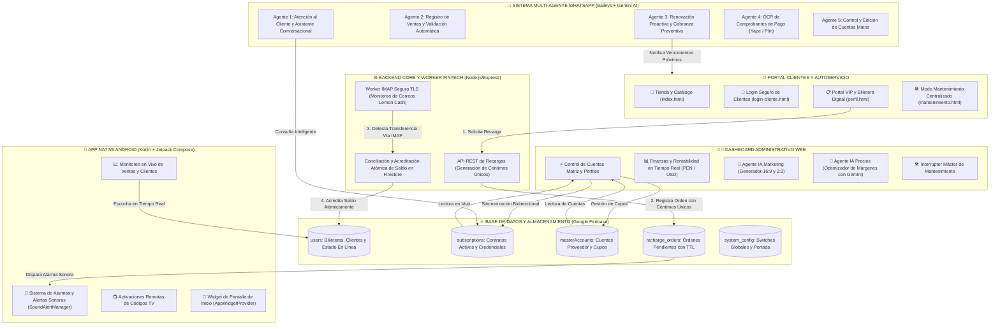

<p align="center">
  <strong>🌐 Idiomas / Languages / Sprachen:</strong><br>
  <a href="README.md"><b>Español 🇪🇸</b></a> &nbsp;|&nbsp;
  <a href="README_EN.md"><b>English 🇺🇸</b></a> &nbsp;|&nbsp;
  <a href="README_DE.md"><b>Deutsch 🇩🇪</b></a>
</p>

# 🐹 CuycitoGO v5.0 — Ecosistema Integral de Gestión de Streaming, Automatización & IA

[](https://cuycitogo.online)
[](https://nodejs.org/)
[](https://expressjs.com/)
[](https://firebase.google.com/)
[](https://developer.android.com/)
[](https://ai.google.dev/)
[](https://github.com/WhiskeySockets/Baileys)
[](https://tailwindcss.com/)

> 🌐 **Sitio Web Oficial:** [https://cuycitogo.online](https://cuycitogo.online)  
> 🔗 **Espejo de Respaldo (Firebase):** [https://cuycitogo-app.web.app](https://cuycitogo-app.web.app)

Bienvenido a **CuycitoGO v5.0**, un ecosistema tecnológico distribuido y de alta disponibilidad diseñado para la gestión integral de suscripciones digitales, control contable de cuentas por cupos, conciliación bancaria automatizada (Fintech/IMAP), soporte autónomo multicanal mediante **Agentes de WhatsApp con Google Gemini AI** y administración móvil nativa en **Android con Jetpack Compose**.

---

## 🏛️ Arquitectura Distribuida del Ecosistema



---

## 🌟 Módulos y Capacidades Técnicas

### 1. 🌐 Portal Web & Autoservicio para Clientes
- **Caché Persistente Multi-Pestaña en Firestore**: Carga en 0ms y reducción de más del 80% en lecturas a la base de datos gracias a `persistentLocalCache` y `persistentMultipleTabManager`.
- **Billetera Digital y Renovación en 1 Clic**: Los clientes visualizan el tiempo restante de sus cuentas, pueden renovar instantáneamente descontando su saldo o cargar capturas QR de TV para activaciones de streaming.
- **Rastreo de Presencia en Tiempo Real**: Indicador dinámico de estado en línea (punto verde pulsante 🟢 / gris ⚪) sincronizado de forma reactiva con el panel del administrador.
- **Modo Mantenimiento Máster**: Con un solo interruptor en el panel administrativo se desvía el tráfico público a una pantalla estilizada (`mantenimiento.html`) con enlaces directos de asistencia.
- **URL en Producción**: Desplegado y operativo en **[https://cuycitogo.online](https://cuycitogo.online)** *(Espejo de respaldo: [cuycitogo-app.web.app](https://cuycitogo-app.web.app))*.

### 2. 🍋 Backend & Conciliación Bancaria Automatizada (Worker IMAP)
- **Lógica de Céntimos Únicos**: Asignación automática de centavos aleatorios a cada orden de recarga (ej. `S/ 15.37`) para identificar transferencias unívocamente sin requerir confirmación manual.
- **Worker IMAP Asíncrono con TLS**: Monitorea de forma continua la bandeja de entrada de notificaciones bancarias (Lemon Cash), analiza el cuerpo de los correos mediante expresiones regulares sanitizadas y acredita saldo en Firestore usando transacciones atómicas.

### 3. 🤖 Ecosistema Multi-Agente Autónomo de WhatsApp (Baileys + Gemini AI)
- **Conexión Multi-Dispositivo**: Pasarela construida sobre `@whiskeysockets/baileys` con reconexión automática y soporte de vinculación por código numérico de 8 dígitos.
- **Atención al Cliente Conversacional**: Respuestas contextuales generadas con Google Gemini AI respetando el catálogo, promociones vigentes y políticas de servicio.
- **Renovación Proactiva Automatizada**: Notificaciones programadas enviadas a clientes con suscripciones próximas a expirar (3 días antes, 1 día antes y día de vencimiento), permitiendo renovar con su saldo mediante respuestas como `"1"`.
- **Módulo OCR de Comprobantes**: Extracción y verificación visual de comprobantes de pago (Yape, Plin y transferencias bancarias).
- **Control Administrativo Vía Comandos**: Comandos como `@cuentamatriz` y `@cuentamatrizeditar` permiten a los administradores auditar y modificar credenciales de cuentas proveedor directamente desde un chat de WhatsApp.

### 4. 📱 Aplicación Móvil Android Nativa (`android-admin-app/`)
- **Arquitectura**: Desarrollada en **Kotlin** con **Jetpack Compose**, **Material 3** y arquitectura **MVVM (Model-View-ViewModel)**.
- **Monitoreo en Tiempo Real**: Escucha reactiva mediante `FirebaseManager` para detectar nuevas recargas, pedidos y clientes en espera.
- **Gestión de Alarmas Sonoras**: `SoundAlertManager` reproduce alertas acústicas diferenciadas ante órdenes pendientes o eventos urgentes.
- **App Widget Nativo**: `CuycitoWidgetProvider` para la pantalla de inicio de Android con métricas y alertas en vivo sin necesidad de abrir la aplicación.

### 5. 🧠 Suite de Inteligencia Artificial (Google Gemini API)
- **Agente de Marketing & Creación de Contenido**: Generador asistido por IA de noticias, estrenos de cartelera y copies para redes sociales con control de encuadre en aspectos 16:9 (noticias) y 2:3 (pósters).
- **Agente de Precios & Rentabilidad**: Analizador de márgenes de beneficio por cupo individual frente al costo oficial de mercado en Perú (PEN), recomendando estrategias comerciales óptimas.

### 6. 📊 Herramienta de Finanzas en Python (`finanzas.py`)
- Suite de escritorio interactiva desarrollada en Python con Tkinter/CustomTkinter para el balance contable histórico, proyección de ingresos recurrentes (MRR) y cálculo de costes por proveedor.

---

## 📁 Estructura del Proyecto

```text
CuycitoGo/
├── index.html                      # Tienda pública y catálogo de streaming
├── dashboard.html                  # Panel administrativo web central
├── perfil.html                     # Portal de autoservicio para clientes VIP
├── login-cliente.html              # Autenticación de clientes
├── login.html                      # Inicio de sesión de administradores
├── mantenimiento.html              # Pantalla de bloqueo por mantenimiento técnico
├── cartelera.html & estrenos.html  # Vistas de contenido multimedia y novedades
├── finanzas.py                     # Herramienta financiera de escritorio en Python
├── firebase.json                   # Configuración de despliegue en Firebase Hosting
├── netlify.toml                    # Configuración para despliegue alternativo en Netlify
│
├── js/                             # Módulos JavaScript (ES6 Modules)
│   ├── app.js                      # Lógica del panel administrativo y gestión DB
│   ├── profile.js                  # Lógica del portal del cliente y billetera
│   ├── store.js                    # Carrito y pasarela del catálogo
│   ├── firebase-config.js          # Inicialización y caché multi-pestaña de Firestore
│   ├── ai-marketing-agent.js       # Agente de generación de contenido con Gemini
│   ├── ai-pricing-agent.js         # Agente de optimización de precios y márgenes
│   ├── admin-notifications.js      # Sistema de alertas visuales y audios
│   └── security-guard.js           # Guardián de sesión y control de accesos
│
├── backend/                        # API REST y Worker de Conciliación IMAP
│   ├── server.js                   # Servidor Express y endpoints de órdenes
│   ├── recharge-controller.js      # Controlador de recargas y céntimos únicos
│   ├── lemon-imap-service.js       # Worker IMAP con TLS para lectura bancaria
│   ├── security-middleware.js      # Rate limiting, sanitización y cabeceras
│   ├── config.js                   # Configuración centralizada con dotenv
│   └── .env.example                # Plantilla de variables de entorno del backend
│
├── whatsapp_agent_service/         # Microservicio Multi-Agente de WhatsApp
│   ├── whatsapp-bridge.js          # Conector Baileys con soporte multi-dispositivo
│   ├── agent-server.js             # API interna de agentes de mensajería
│   ├── atencion-cliente-agent-service.js # Asistente conversacional con IA
│   ├── renovacion-proactiva-service.js   # Notificaciones preventivas de expiración
│   ├── cuentamatriz-service.js     # Wizard de gestión de cuentas proveedor
│   ├── voucher-ocr-service.js      # Procesamiento OCR de comprobantes
│   ├── control-manager.js          # Servidor del panel de vinculación local
│   └── .env.example                # Plantilla de variables de entorno de agentes
│
└── android-admin-app/              # App Móvil Nativa de Administración
    └── app/src/main/
        ├── AndroidManifest.xml
        ├── java/com/example/cuycitogoadmin/
        │   ├── MainActivity.kt     # Punto de entrada y navegación Compose
        │   ├── ui/screens/         # Pantallas: Clientes, Recargas, Tienda, Alarmas
        │   ├── data/repository/    # FirebaseManager y flujos reactivos
        │   ├── util/               # SoundAlertManager
        │   └── widget/             # CuycitoWidgetProvider (Widget de escritorio)
        └── res/                    # Layouts, iconos adaptativos y recursos
```

---

## 🚀 Guía de Instalación y Puesta en Marcha Local

### Prerrequisitos
- **Node.js**: v18.0.0 o superior
- **Python**: 3.9 o superior (para `finanzas.py`)
- **Android Studio Iguana / Ladybug** (para compilar la aplicación móvil)
- **Cuenta de Firebase** con Firestore configurado

---

### 1. Configuración del Backend (Worker IMAP y API)
```bash
cd backend
npm install
cp .env.example .env
# Edita las variables en .env con tus credenciales de correo IMAP y datos de recepción
npm start
```

### 2. Configuración del Servicio de Agentes de WhatsApp
```bash
cd ../whatsapp_agent_service
npm install
cp .env.example .env
# Configura tu GEMINI_API_KEY y números de administrador
node control-manager.js
# Abre http://localhost:5005 para vincular tu WhatsApp mediante código de 8 dígitos
```

### 3. Ejecución del Portal Web
Puedes servir el frontend mediante cualquier servidor estático local:
```bash
# Desde el directorio raíz del proyecto:
npx serve .
# O utilizando la extensión Live Server de VS Code abriendo index.html o dashboard.html
```

### 4. Compilación de la App Android Admin
1. Abre el directorio `android-admin-app` en **Android Studio**.
2. Sincroniza el proyecto con los archivos de Gradle (`Sync Project with Gradle Files`).
3. Ejecuta la aplicación en un dispositivo físico o emulador con Android 8.0+ (API 26+).

---

## 🔒 Seguridad & Buenas Prácticas de Ingeniería

- **Separación de Secretos**: Ninguna clave de producción, contraseña de servicio ni sesión activa de mensajería se almacena en el control de versiones. Todas las credenciales se inyectan a través de variables de entorno (`.env`).
- **Anonimización de Datos de Prueba**: Los datos mostrados en los repositorios de demostración corresponden a entidades simuladas (*mock data*) para proteger la privacidad de usuarios y proveedores.
- **Transacciones Atómicas en Firestore**: Toda operación financiera de acreditación y débito de saldo se ejecuta mediante `db.runTransaction()` para evitar condiciones de carrera (*race conditions*) y duplicidad de fondos.
- **Sanitización de Entradas**: Validación de expresiones regulares y escape de caracteres en todas las pasarelas que procesan mensajes entrantes.

---

## 📄 Licencia y Propiedad Intelectual

**Copyright © 2026 Cristhian PE — CuycitoGO. Todos los derechos reservados.**

Este repositorio se publica **exclusivamente con fines de exhibición técnica y evaluación profesional de portafolio**. Queda estrictamente prohibida la copia, duplicación, distribución o explotación comercial de este software o de su código fuente sin el consentimiento previo y por escrito del autor. Consulta el archivo [`LICENSE`](LICENSE) para más detalles.

---

© 2026 **CuycitoGO** • Desarrollado por **Cristhian PE** • Exhibición de Portafolio Profesional.

