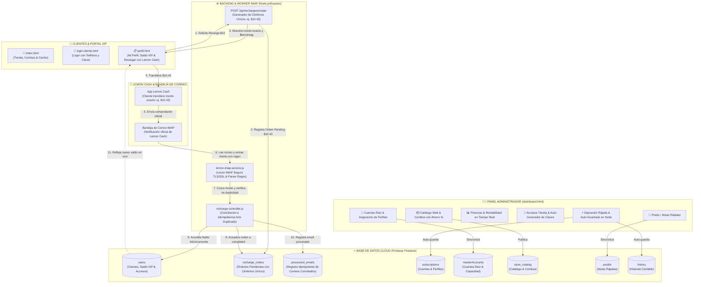

# 🐹 CuycitoGO - Ecosistema de Gestión de Streaming & Tienda Digital

Bienvenido a **CuycitoGO**, una plataforma integral diseñada para la venta, control financiero, administración de cuentas raíz, catálogo web con combos de oferta, notas/post-its en tiempo real, portal exclusivo de clientes y **sistema automatizado de recargas de saldo mediante lectura de correos Lemon Cash con IMAP**.

---

## 🏛️ Organigrama & Arquitectura del Sistema



---

## 🍋 Guía de Configuración: Sistema de Recargas Lemon Cash

### 1. Variables de Entorno en `/backend/.env`
Crea el archivo `.env` dentro de la carpeta `backend/` con las siguientes variables:

```env
# Puerto del Servidor Backend
PORT=5000
NODE_ENV=development

# Configuración IMAP para lectura de correos de Lemon Cash
IMAP_HOST=imap.gmail.com
IMAP_PORT=993
IMAP_TLS=true
IMAP_USER=tu_correo_dedicado@gmail.com
IMAP_APP_PASSWORD=tu_contraseña_de_aplicacion_gmail

# Frecuencia de lectura (15000 = cada 15 segundos)
IMAP_POLL_INTERVAL_MS=15000

# Dominios / Remitentes autorizados de Lemon Cash
LEMON_ALLOWED_SENDERS=no-reply@lemon.me,notificaciones@lemoncash.com,lemon.me,lemoncash.io

# Datos de tu cuenta Lemon Cash para recibir pagos
LEMON_TAG=$cuycitogo
LEMON_CVU=0000123400005678901234
LEMON_ALIAS=cuycitogo.lemon
LEMON_ACCOUNT_HOLDER=CuycitoGO Streaming VIP

# Tiempo de expiración de órdenes (en minutos)
RECHARGE_EXPIRATION_MINUTES=30
```

> [!TIP]
> **¿Cómo obtener la Contraseña de Aplicación en Gmail?**
> 1. Ve a tu Cuenta de Google -> Seguridad -> Verificación en dos pasos.
> 2. En la sección "Contraseñas de aplicaciones", genera una nueva llamada `CuycitoGO IMAP`.
> 3. Copia los 16 caracteres generados y pégalos en `IMAP_APP_PASSWORD`.

### 2. Instalación de Dependencias e Inicio del Backend
Abre una terminal en la carpeta `backend/`:

```bash
cd backend
npm install
npm start
```

### 3. Simulación de Pruebas (Sin necesidad de transferencias reales)
Para probar la conciliación automática en desarrollo:
```bash
node test-email-simulation.js 10.43 $usuario_prueba
```

---

## 📜 Historial de Versiones & Changelog

### 🚀 **Versión 4.4 (Recargas Automáticas Lemon Cash & Auto-Guardado Unificado)**
- **☁️ Auto-Guardado Unificado en el Dashboard**:
  - Eliminación de botones redundantes en el navbar.
  - Indicador interactivo `🟢 Nube Sincronizada (HH:MM:SS)` con confirmación visual automática cada vez que se guarda o modifica un registro.
- **🍋 Sistema de Recargas de Saldo Automatizado con Lemon Cash**:
  - **Lógica de Céntimos Únicos**: Generación de montos aleatorios exclusivos (ej. `$10.43`) para identificar de forma unívoca a cada cliente.
  - **Servicio IMAP & Parser Regex**: Lectura continua de la bandeja de correo, filtro estricto de remitentes Lemon Cash y extracción del monto exacto con céntimos.
  - **Conciliación e Idempotencia**: Acreditación atómica a la billetera del usuario en Firestore y protección contra correos duplicados (`processed_emails`).
  - **Billetera VIP en Portal del Cliente ([perfil.html](file:///c:/Users/Cristhian/Desktop/CuzcitoGo/perfil.html))**: Modal interactivo de recarga con datos copiables de Lemon Cash y verificación en tiempo real.

---

© 2026 **CuycitoGO** • Todos los derechos reservados.
