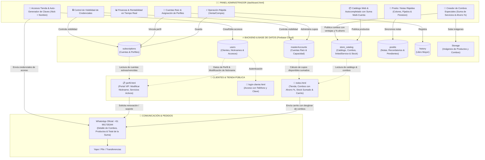

# 🐹 CuycitoGO - Ecosistema de Gestión de Streaming & Tienda Digital

Bienvenido a **CuycitoGO**, una plataforma integral diseñada para la venta, control financiero, administración de cuentas raíz y gestión de perfiles de servicios de streaming (Netflix, Spotify, Disney+, Max, Prime Video, etc.) con portal exclusivo de clientes, notas/post-its en tiempo real, creador de combos de ofertas y tienda pública sincronizada con Firebase.

---

## 🏛️ Organigrama & Arquitectura del Sistema

---

## 📜 Historial de Versiones & Changelog

### 🚀 **Versión 4.3 (Notas Posit en Panel & Creador de Combos de Ofertas)**
- **📌 Apartado de Posit / Notas Rápidas en el Dashboard**:
  - Ubicado en el panel lateral derecho, directamente debajo de las alertas de vencimiento.
  - Sincronizado en tiempo real con la colección `postits` de Firebase Firestore.
  - Paleta de 5 colores temáticos (Amarillo, Verde, Celeste, Rosa, Morado), fijado de notas prioritarias arriba (Pin 📌), edición en caliente y eliminación.
- **🎁 Creador Dinámico de Combos de Servicios & Ofertas**:
  - Modal especializado accesible desde el botón *Crear Combo Oferta 🔥* en Catálogo Web.
  - **Suma de Servicios Modular**: Permite agregar múltiples plataformas (`Servicio 1 + Servicio 2 + ...`).
  - **Cálculo Automático en Vivo**:
    * Suma de Precios Regulares Unitarios (Tachado).
    * Precio Oferta Especial del Combo.
    * Ahorro en Dinero (S/) y Porcentaje de Ahorro (`% DE AHORRO`).
  - **Ventajas Comerciales**: Lista de ventajas destacadas (perfiles privados, calidad 4K, garantía 30 días, PIN independiente).
  - **Diseño de Tarjetas Combo en Tienda Pública ([index.html](file:///c:/Users/Cristhian/Desktop/CuzcitoGo/index.html))**:
    * Badge de `-XX% COMBO AHORRO`.
    * Desglose de servicios incluidos y precios unitarios.
    * Integración completa con el carrito y mensajes de WhatsApp (+51 991735344).

---

### 🚀 **Versión 4.2 (Suma Multi-Cuenta Raíz en Catálogo & Nickname Inicial)**
- **📦 Carga Automática Avanzada & Suma de Cuentas Raíz en Catálogo**:
  - Suma de cupos libres entre múltiples cuentas de la misma plataforma (ej. 2 Cuentas Netflix = 7 cupos libres).
- **👤 Tratamiento de Nickname y Nombre en Clientes**:
  - Nickname = Nombre completo por defecto; en el portal del cliente el Nombre Real es fijo y solo se edita el Nickname.

---

### 🚀 **Versión 4.1 (Visibilidad de Credenciales & WhatsApp Oficial)**
- **🔒 Política Estricta de Visibilidad de Credenciales**:
  - Credenciales ocultas para clientes si la cuenta matriz no tiene permiso activado.
- **📲 Integración de WhatsApp Oficial (+51 991735344)**.

---

### 🚀 **Versión 4.0 (Seguridad, Auto-Accesos y Stock en Vivo)**
- **⚡ Generador Automático de Accesos Web con Teléfono Aleatorio**: Generación de credenciales en 1-clic.

---

© 2026 **CuycitoGO** • Todos los derechos reservados.
