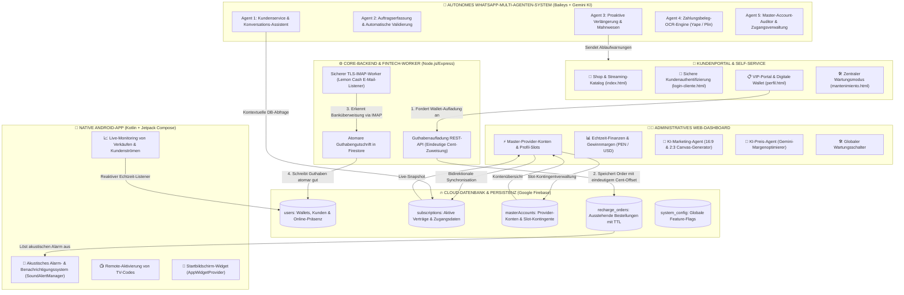

<p align="center">
  <strong>🌐 Sprachen / Languages / Idiomas:</strong><br>
  <a href="README.md"><b>Español 🇪🇸</b></a> &nbsp;|&nbsp;
  <a href="README_EN.md"><b>English 🇺🇸</b></a> &nbsp;|&nbsp;
  <a href="README_DE.md"><b>Deutsch 🇩🇪</b></a>
</p>

# 🐹 CuycitoGO v5.0 — Streaming-Verwaltungs-, Automatisierungs- & KI-Ökosystem

[](https://cuycitogo.online)
[](https://nodejs.org/)
[](https://expressjs.com/)
[](https://firebase.google.com/)
[](https://developer.android.com/)
[](https://ai.google.dev/)
[](https://github.com/WhiskeySockets/Baileys)
[](https://tailwindcss.com/)

> 🌐 **Offizielle Produktions-Website:** [https://cuycitogo.online](https://cuycitogo.online)  
> 🔗 **Backup-Spiegel (Firebase):** [https://cuycitogo-app.web.app](https://cuycitogo-app.web.app)

Willkommen bei **CuycitoGO v5.0**, einem verteilten, hochverfügbaren Technologie-Ökosystem für das ganzheitliche Management digitaler Abonnements, profilbasierte Kontingentbuchhaltung, automatisierten Bankabgleich (Fintech/IMAP), autonomen Multikanal-Kundensupport über **WhatsApp-Agenten mit Google Gemini KI** sowie eine native mobile Verwaltung unter **Android mit Jetpack Compose**.

---

## 🏛️ Verteilte Ökosystem-Architektur



---

## 🌟 Module & Technische Leistungsmerkmale

### 1. 🌐 Webportal & Kunden-Self-Service
- **Persistentes Firestore-Multi-Tab-Caching**: Ladezeiten von 0 ms und über 80 % Einsparung bei Datenbank-Lesezugriffen durch `persistentLocalCache` und `persistentMultipleTabManager`.
- **Digitale Wallet & 1-Klick-Verlängerung**: Endkunden behalten verbleibende Abonnementlaufzeiten im Blick, verlängern sofort über ihr Guthaben oder laden TV-QR-Screenshots zur schnellen Freischaltung hoch.
- **Echtzeit-Präsenzerfassung**: Dynamische Online-Statusanzeige (pulsierender grüner Punkt 🟢 / grau ⚪), live synchronisiert mit dem Administrations-Dashboard.
- **Zentraler Master-Wartungsschalter**: Sofortige Umleitung des öffentlichen Datenverkehrs auf einen ansprechend gestalteten Wartungsbildschirm (`mantenimiento.html`) mit direktem Support-Zugang.
- **Produktions-URL**: Bereitgestellt und einsatzbereit unter **[https://cuycitogo.online](https://cuycitogo.online)** *(Backup-Spiegel: [cuycitogo-app.web.app](https://cuycitogo-app.web.app))*.

### 2. 🍋 Backend & Automatisierter Bankabgleich (IMAP-Worker)
- **Eindeutige Cent-Zuweisung**: Automatische Generierung von Zufalls-Centbeträgen bei Aufladeaufträgen (z. B. `S/ 15.37`), um Überweisungen ohne manuelle Prüfung eindeutig und verwechslungssicher zuzuordnen.
- **Asynchroner TLS-IMAP-Worker**: Kontinuierliche Überwachung des Eingangs von Bankbenachrichtigungen (Lemon Cash), Extraktion relevanter Transaktionsdaten über bereinigte Regex-Filter und atomare Buchung in Firestore mittels Datenbanktransaktionen.

### 3. 🤖 Autonomes WhatsApp-Multi-Agenten-System (Baileys + Gemini KI)
- **Multi-Device-Verbindungsgateway**: Basiert auf `@whiskeysockets/baileys` mit automatischer Wiederverbindung und Kopplung via 8-stelligem Zahlencode.
- **Konversationeller Kundenservice**: Kontextbezogene Antworten, dynamisch generiert durch Google Gemini KI unter strikter Einhaltung von Preislisten, Service-Richtlinien und Rabattaktionen.
- **Proaktive Ablauf- & Verlängerungsmeldungen**: Zeitgesteuerte Benachrichtigungen an Kunden vor Ablauf ihres Abonnements (3 Tage vorher, 1 Tag vorher und am Ablauftag) mit sofortiger 1-Klick-Verlängerung per Kurzantwort (z. B. `"1"`).
- **Beleg-OCR-Erkennung**: Computer-Vision-Pipeline zur visuellen Prüfung und Auswertung von Zahlungsbelegen (Yape, Plin und Banküberweisungen).
- **In-Chat-Admin-Befehle**: Administrative Befehle wie `@cuentamatriz` und `@cuentamatrizeditar` ermöglichen die Überprüfung und Aktualisierung von Zugangsdaten der Provider-Konten direkt aus dem WhatsApp-Chat.

### 4. 📱 Native Android-Administrations-App (`android-admin-app/`)
- **Moderne Architektur**: Vollständig in **Kotlin** implementiert mit **Jetpack Compose**, **Material 3** und dem **MVVM-Architekturmuster (Model-View-ViewModel)**.
- **Reaktives Telemetrie-Monitoring**: Echtzeit-Listener via `FirebaseManager` für eingehende Aufladungen, neue Abonnements und offene Kundenanfragen.
- **Akustisches Alarmsystem**: `SoundAlertManager` signalisiert dringende Vorfälle und neue Bestellungen mit differenzierten Audiosignalen.
- **Natives Android-Widget**: `CuycitoWidgetProvider` liefert Live-Kennzahlen, offene Aufträge und aktive Kunden direkt auf den Startbildschirm.

### 5. 🧠 Künstliche Intelligenz Suite (Google Gemini API)
- **KI-Marketing- & Content-Generator**: KI-gestützter Generator für Neuerscheinungen, Filmpremieren und Social-Media-Texte mit automatischer Bildanpassung in den Seitenverhältnissen 16:9 (News-Banner) und 2:3 (Plakatformat).
- **KI-Preis- & Margenoptimierer**: Analysiert Großhandelspreise pro Profil gegenüber den offiziellen Streaming-Tarifen in Peru (PEN) und empfiehlt optimale Vertriebsmargen.

### 6. 📊 Python Desktop-Finanzsuite (`finanzas.py`)
- Eigenständige Desktop-Anwendung auf Basis von Python und Tkinter/CustomTkinter zur historischen Buchführung, Prognose wiederkehrender Monatsumsätze (MRR) und Lieferantenkostenanalyse.

---

## 📁 Projektstruktur

```text
CuycitoGo/
├── index.html                      # Öffentlicher Webshop & Streaming-Katalog
├── dashboard.html                  # Zentrales administratives Web-Dashboard
├── perfil.html                     # Kunden-Self-Service-Portal & Wallet
├── login-cliente.html              # Kunden-Authentifizierung
├── login.html                      # Administrator-Anmeldung
├── mantenimiento.html              # Zentraler Wartungs-Sperrbildschirm
├── cartelera.html & estrenos.html  # Multimedia-Katalog & Neuerscheinungen
├── finanzas.py                     # Python-Desktop-Finanzanalysetool
├── firebase.json                   # Firebase-Hosting-Konfiguration & Rewrites
├── netlify.toml                    # Sekundäre Deployment-Konfiguration
│
├── js/                             # Frontend ES6-Module
│   ├── app.js                      # Admin-Dashboard-Logik & DB-Steuerung
│   ├── profile.js                  # Kundenportal-Wallet & Abo-Verwaltung
│   ├── store.js                    # Warenkorb- & Kassenabwicklung
│   ├── firebase-config.js          # Firestore-Multi-Tab-Persistenz-Setup
│   ├── ai-marketing-agent.js       # Gemini-gestützter Marketing-Content-Agent
│   ├── ai-pricing-agent.js         # Gemini-basierter Preis- und Margenoptimierer
│   ├── admin-notifications.js      # Visueller & akustischer Alert-Koordinator
│   └── security-guard.js           # RBAC-Sicherheits- & Routenschutz
│
├── backend/                        # Node.js Express REST-API & IMAP-Worker
│   ├── server.js                   # API-Gateway & Order-Server
│   ├── recharge-controller.js      # Generator für eindeutige Centbeträge
│   ├── lemon-imap-service.js       # TLS-IMAP-Worker zur Überweisungsprüfung
│   ├── security-middleware.js      # Rate Limiting, Input-Sanitizing & Header
│   ├── config.js                   # Dotenv-Umgebungskonfiguration
│   └── .env.example                # Vorlage für Backend-Umgebungsvariablen
│
├── whatsapp_agent_service/         # WhatsApp Multi-Agenten-Mikroservice
│   ├── whatsapp-bridge.js          # Baileys-Socket-Verbindung (Multi-Device)
│   ├── agent-server.js             # Interne Messaging-Orchestrierungs-API
│   ├── atencion-cliente-agent-service.js # KI-Kundenservice-Assistent
│   ├── renovacion-proactiva-service.js   # Automatische Verlängerungs-Meldungen
│   ├── cuentamatriz-service.js     # Provider-Account-Auditor & Assistent
│   ├── voucher-ocr-service.js      # Beleg-OCR-Verarbeitung
│   ├── control-manager.js          # Lokales Web-Kopplungs-Dashboard
│   └── .env.example                # Vorlage für Agenten-Umgebungsvariablen
│
└── android-admin-app/              # Native Android-Administrationsanwendung
    └── app/src/main/
        ├── AndroidManifest.xml
        ├── java/com/example/cuycitogoadmin/
        │   ├── MainActivity.kt     # Jetpack Compose Navigation & Startpunkt
        │   ├── ui/screens/         # Screens: Kunden, Aufladungen, Shop, Alarme
        │   ├── data/repository/    # FirebaseManager & reaktive Datenströme
        │   ├── util/               # SoundAlertManager
        │   └── widget/             # CuycitoWidgetProvider (Startbildschirm-Widget)
        └── res/                    # Vektor-Drawables, Themes & App-Icons
```

---

## 🚀 Lokale Installation & Inbetriebnahme

### Voraussetzungen
- **Node.js**: v18.0.0 oder höher
- **Python**: 3.9 oder höher (für `finanzas.py`)
- **Android Studio Iguana / Ladybug** (zur Kompilierung der Android-App)
- **Firebase-Konto** mit eingerichtetem Cloud Firestore

---

### 1. Konfiguration des Backends (IMAP-Worker & API)
```bash
cd backend
npm install
cp .env.example .env
# Tragen Sie Ihre IMAP-Zugangsdaten und Konfigurationen in .env ein
npm start
```

### 2. Konfiguration des WhatsApp-Multi-Agenten-Dienstes
```bash
cd ../whatsapp_agent_service
npm install
cp .env.example .env
# Hinterlegen Sie Ihren GEMINI_API_KEY und die Administrator-Telefonnummern
node control-manager.js
# Öffnen Sie http://localhost:5005, um WhatsApp per 8-stelligem Code zu koppeln
```

### 3. Starten des Webportals
Die statischen Frontend-Ressourcen können über einen beliebigen lokalen Webserver bereitgestellt werden:
```bash
# Im Projekt-Stammverzeichnis:
npx serve .
# Oder direkt per Live Server-Erweiterung in VS Code über index.html / dashboard.html
```

### 4. Kompilierung der Android-Admin-App
1. Öffnen Sie das Verzeichnis `android-admin-app` in **Android Studio**.
2. Führen Sie die Gradle-Projekt-Synchronisierung durch (`Sync Project with Gradle Files`).
3. Starten Sie die Anwendung auf einem physischen Testgerät oder Emulator mit Android 8.0+ (API-Level 26+).

---

## 🔒 Sicherheit & Engineering-Best-Practices

- **Strikte Trennung von Zugangsdaten**: Es werden weder Produktionsschlüssel, Passwörter noch aktive WhatsApp-Sitzungen in der Versionskontrolle gespeichert. Alle sensiblen Daten werden dynamisch über Umgebungsvariablen (`.env`) bereitgestellt.
- **Anonymisierte Showcase-Daten**: Alle in Demonstrationen sichtbaren Daten sind synthetische Testdaten (*Mock Data*), um die Privatsphäre von Kunden und Lieferanten zu schützen.
- **Atomare Transaktionen in Firestore**: Sämtliche finanzwirksamen Buchungen und Saldoveränderungen werden innerhalb von `db.runTransaction()` ausgeführt, um Race Conditions und doppelte Gutschriften auszuschließen.
- **Eingabebereinigung**: Robuste Validierung regulärer Ausdrücke und Zeichenmaskierung an allen Schnittstellen, die externe Nachrichten oder Anfragen verarbeiten.

---

## 📄 Urheberrecht & Lizenz

**Copyright © 2026 Cristhian PE — CuycitoGO. Alle Rechte vorbehalten.**

Dieses Repository wird **ausschließlich zu Demonstrations-, Portfolio- und technischen Evaluierungszwecken** bereitgestellt. Die Vervielfältigung, Verbreitung, Modifikation oder kommerzielle Verwertung dieser Software oder ihres Quellcodes ohne vorherige ausdrückliche schriftliche Genehmigung des Urhebers ist untersagt. Weitere Details finden Sie in der Datei [`LICENSE`](LICENSE).

---

© 2026 **CuycitoGO** • Entwickelt von **Cristhian PE** • Professionelles Portfolio-Showcase.
