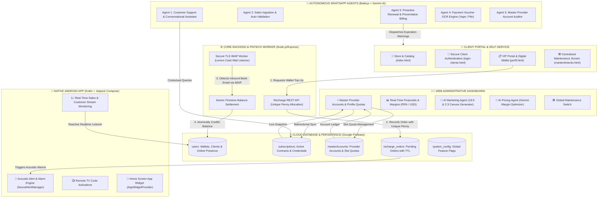

<p align="center">
  <strong>🌐 Languages / Idiomas / Sprachen:</strong><br>
  <a href="README.md"><b>Español 🇪🇸</b></a> &nbsp;|&nbsp;
  <a href="README_EN.md"><b>English 🇺🇸</b></a> &nbsp;|&nbsp;
  <a href="README_DE.md"><b>Deutsch 🇩🇪</b></a>
</p>

# 🐹 CuycitoGO v5.0 — Streaming Management, Automation & AI Ecosystem

[](https://cuycitogo.online)
[](https://nodejs.org/)
[](https://expressjs.com/)
[](https://firebase.google.com/)
[](https://developer.android.com/)
[](https://ai.google.dev/)
[](https://github.com/WhiskeySockets/Baileys)
[](https://tailwindcss.com/)

> 🌐 **Official Production Website:** [https://cuycitogo.online](https://cuycitogo.online)  
> 🔗 **Backup Mirror (Firebase):** [https://cuycitogo-app.web.app](https://cuycitogo-app.web.app)

Welcome to **CuycitoGO v5.0**, a distributed, high-availability technology ecosystem designed for comprehensive digital subscription management, profile-level quota accounting, automated bank reconciliation (Fintech/IMAP), autonomous multi-channel customer support powered by **WhatsApp Agents with Google Gemini AI**, and native mobile administration via **Android with Jetpack Compose**.

---

## 🏛️ Distributed Ecosystem Architecture



---

## 🌟 Modules & Engineering Capabilities

### 1. 🌐 Web Portal & Client Self-Service
- **Firestore Multi-Tab Persistent Caching**: Instant 0ms load times and over 80% reduction in database read operations utilizing `persistentLocalCache` and `persistentMultipleTabManager`.
- **Digital Wallet & 1-Click Renewals**: End-users track subscription time remaining, renew instantaneously against their balance, or upload TV QR captures for rapid streaming activation.
- **Real-Time Presence Tracking**: Reactive online state indicator (pulsing green 🟢 / idle grey ⚪) synchronized live with the admin dashboard.
- **Master Maintenance Switch**: Single-click kill-switch redirecting public traffic to an elegant maintenance landing screen (`mantenimiento.html`) with direct support fallbacks.
- **Production URL**: Deployed and operational at **[https://cuycitogo.online](https://cuycitogo.online)** *(Backup mirror: [cuycitogo-app.web.app](https://cuycitogo-app.web.app))*.

### 2. 🍋 Backend & Automated Bank Reconciliation (IMAP Worker)
- **Unique Penny Allocation Algorithm**: Automatic generation of pseudo-random cent offsets on recharge orders (e.g., `S/ 15.37`) to uniquely attribute unauthenticated bank transfers without manual human intervention.
- **Asynchronous TLS IMAP Worker**: Continuously audits inbound financial notification emails (Lemon Cash), parses payloads using sanitized regex filters, and atomically credits user balances in Firestore via transactions.

### 3. 🤖 Autonomous Multi-Agent WhatsApp System (Baileys + Gemini AI)
- **Multi-Device Connection Gateway**: Built on `@whiskeysockets/baileys` with auto-reconnection mechanics and numeric 8-digit pairing code support.
- **Conversational Customer Support**: Contextual responses dynamically synthesized by Google Gemini AI, constrained by service policies, catalogs, and active promotional campaigns.
- **Proactive Expiration Warnings**: Automated cron notifications sent to clients ahead of subscription expiry (T-3 days, T-1 day, and expiry day), enabling immediate 1-tap renewals via simple text replies (e.g., `"1"`).
- **Voucher OCR Engine**: Computer vision pipeline verifying bank vouchers and mobile wallet slips (Yape, Plin).
- **In-Chat Admin Command Wizard**: Administrative commands such as `@cuentamatriz` and `@cuentamatrizeditar` empower administrators to inspect and update provider account credentials directly within WhatsApp.

### 4. 📱 Native Android Administrative App (`android-admin-app/`)
- **Modern Architecture**: Written purely in **Kotlin** with **Jetpack Compose**, **Material 3**, and **MVVM (Model-View-ViewModel)** design patterns.
- **Reactive Telemetry**: Live Firestore listeners via `FirebaseManager` to capture incoming balance top-ups, new subscriptions, and pending support requests.
- **Acoustic Alert Engine**: `SoundAlertManager` triggers distinct auditory warnings based on order severity and urgency.
- **Native Android Widget**: `CuycitoWidgetProvider` brings real-time financial metrics, pending order counters, and active subscriber tallies straight to the device's home screen.

### 5. 🧠 Artificial Intelligence Suite (Google Gemini API)
- **AI Marketing & Content Generator**: Autonomous assistant generating movie/series release announcements, promotional social copy, and automated framing presets in 16:9 (news banner) and 2:3 (poster) aspect ratios.
- **AI Pricing & Margin Optimizer**: Algorithmic profitability engine evaluating per-profile wholesale costs against prevailing official retail streaming rates in Peru (PEN), advising on competitive pricing strategies.

### 6. 📊 Python Desktop Financial Suite (`finanzas.py`)
- Standalone analytical application crafted with Python and Tkinter/CustomTkinter for historic bookkeeping, monthly recurring revenue (MRR) forecasting, and supplier cost auditing.

---

## 📁 Repository Structure

```text
CuycitoGo/
├── index.html                      # Public storefront & streaming catalog
├── dashboard.html                  # Central web administrative dashboard
├── perfil.html                     # Client self-service portal & digital wallet
├── login-cliente.html              # Customer authentication portal
├── login.html                      # Administrative login entrypoint
├── mantenimiento.html              # System-wide maintenance lockdown screen
├── cartelera.html & estrenos.html  # Multimedia catalog & premier highlights
├── finanzas.py                     # Python desktop financial auditing tool
├── firebase.json                   # Firebase Hosting configuration & rewrites
├── netlify.toml                    # Secondary deployment configuration
│
├── js/                             # Frontend ES6 Modules
│   ├── app.js                      # Admin dashboard business logic & DB controller
│   ├── profile.js                  # Client portal wallet & subscription manager
│   ├── store.js                    # Cart & purchase checkout flow
│   ├── firebase-config.js          # Multi-tab Firestore persistence configuration
│   ├── ai-marketing-agent.js       # Gemini-powered marketing copy engine
│   ├── ai-pricing-agent.js         # Gemini-driven pricing & profit margin analyzer
│   ├── admin-notifications.js      # Visual and acoustic notification coordinator
│   └── security-guard.js           # RBAC session validator & route guard
│
├── backend/                        # Node.js Express REST API & IMAP Worker
│   ├── server.js                   # API gateway & order dispatch server
│   ├── recharge-controller.js      # Unique penny generator & order lifecycle
│   ├── lemon-imap-service.js       # TLS IMAP bank notification polling daemon
│   ├── security-middleware.js      # Rate limiting, input sanitization & security headers
│   ├── config.js                   # Dotenv environment configuration
│   └── .env.example                # Backend environment template
│
├── whatsapp_agent_service/         # WhatsApp Multi-Agent Microservice
│   ├── whatsapp-bridge.js          # Baileys multi-device socket connector
│   ├── agent-server.js             # Internal messaging orchestrator API
│   ├── atencion-cliente-agent-service.js # AI conversational support agent
│   ├── renovacion-proactiva-service.js   # Automated subscription renewal reminder
│   ├── cuentamatriz-service.js     # Provider credential wizard & auditor
│   ├── voucher-ocr-service.js      # Payment slip OCR recognition pipeline
│   ├── control-manager.js          # Local web pairing dashboard server
│   └── .env.example                # Agents environment template
│
└── android-admin-app/              # Native Android Admin Application
    └── app/src/main/
        ├── AndroidManifest.xml
        ├── java/com/example/cuycitogoadmin/
        │   ├── MainActivity.kt     # Jetpack Compose navigation root
        │   ├── ui/screens/         # Screens: Clients, Orders, Store, Alarms
        │   ├── data/repository/    # FirebaseManager & reactive data streams
        │   ├── util/               # SoundAlertManager
        │   └── widget/             # CuycitoWidgetProvider (Home screen widget)
        └── res/                    # Vector drawables, themes & adaptive assets
```

---

## 🚀 Local Setup & Installation Guide

### Prerequisites
- **Node.js**: v18.0.0 or higher
- **Python**: 3.9 or higher (for `finanzas.py`)
- **Android Studio Iguana / Ladybug** (to build the mobile client)
- **Firebase Project** with Cloud Firestore enabled

---

### 1. Backend Service Configuration (IMAP Worker & API)
```bash
cd backend
npm install
cp .env.example .env
# Configure your IMAP bank credentials and port settings in .env
npm start
```

### 2. WhatsApp Multi-Agent Microservice Setup
```bash
cd ../whatsapp_agent_service
npm install
cp .env.example .env
# Set your GEMINI_API_KEY and designated administrator phone numbers
node control-manager.js
# Navigate to http://localhost:5005 to pair WhatsApp via an 8-digit code
```

### 3. Running the Web Portals
Serve the static front-end assets via any preferred local HTTP server:
```bash
# From the project root directory:
npx serve .
# Or launch index.html / dashboard.html directly via the VS Code Live Server extension
```

### 4. Compiling the Native Android Application
1. Launch **Android Studio** and open the `android-admin-app` directory.
2. Synchronize the build configuration with Gradle (`Sync Project with Gradle Files`).
3. Run the application on a connected hardware device or emulator running Android 8.0+ (API level 26+).

---

## 🔒 Security & Engineering Best Practices

- **Strict Secret Segregation**: Zero production credentials, service passwords, or active WhatsApp sessions are tracked in version control. All secrets are injected dynamically via environment variables (`.env`).
- **Anonymized Showcase Data**: All entities displayed in demo captures and fixtures represent simulated mock data to preserve client and vendor privacy.
- **Firestore Atomic Transactions**: All financial write operations (top-ups, slot debits, balance consumption) are executed inside `db.runTransaction()` blocks to prevent race conditions and double-spending anomalies.
- **Input Sanitization**: Thorough regex validation and payload sanitization across all external-facing message parsers and API controllers.

---

## 📄 Intellectual Property & License

**Copyright © 2026 Cristhian PE — CuycitoGO. All Rights Reserved.**

This repository is published **strictly for technical evaluation, portfolio demonstration, and educational review**. Any copying, duplication, modification, distribution, or commercial exploitation of this software or its underlying source code without prior explicit written permission from the copyright owner is strictly prohibited. Refer to the [`LICENSE`](LICENSE) file for complete terms.

---

© 2026 **CuycitoGO** • Engineered by **Cristhian PE** • Professional Portfolio Showcase.
